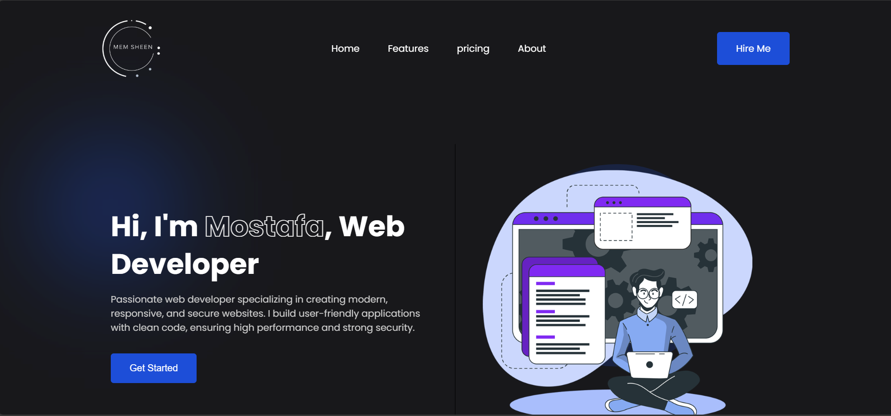

# Personal Portfolio

Welcome to my personal portfolio! This project showcases my skills, experience, and projects in a clean and interactive design. It serves as a digital resume and a platform to highlight my work in web development.

---

## 🔗 Live Demo

[View Portfolio](https://mostafashaddad.github.io/portfolio/)

---

## 📂 Project Overview

This portfolio is designed to provide an easy and engaging way for visitors to explore my work, skills, and background. It features a modern and responsive design, ensuring a seamless experience across all devices.

---

## ✨ Features

- **Responsive Design**: Fully optimized for mobile, tablet, and desktop devices. 📱💻  
- **Interactive UI/UX**: Smooth animations and transitions for an engaging user experience. 🎨  
- **Project Showcase**: Displays my projects with descriptions, images, and links. 🔗  
- **About Me Section**: Highlights my experience, skills, and background. 👨‍💻  
- **Contact Section**: Includes social media links and a direct email option for inquiries. 📬  

---

## 🛠️ Technologies Used

- **HTML**: Structure of the website.  
- **CSS**: Styling, animations, and layout using Flexbox and Grid.  
- **JavaScript**: Adds interactivity and dynamic behavior to the site.  

---

## 📸 Screenshots



---

## 🚀 Getting Started

### Clone the Repository

To get a local copy of this project, follow these steps:

1. Open your terminal or command prompt.
2. Run the following command to clone the repository:

```sh
git clone https://github.com/mostafashaddad/portfolio.git
```

3. Navigate to the project directory:

```sh
cd portfolio
```

4. Open the `index.html` file in your browser to view the portfolio locally.

---

## 📄 License

This project is licensed under the **MIT License**. Feel free to use, modify, and distribute it as per the license terms.

---

## 📬 Contact Me

If you have any questions, suggestions, or would like to collaborate, feel free to reach out:

- **Email**: [mostafashaddadd@gmail.com](mailto:mostafashaddadd@gmail.com)  
- **LinkedIn**: [Mostafa Shaddad](https://www.linkedin.com/in/mostafa-shaddad-6493a4345/)  
- **GitHub**: [mostafashaddad](https://github.com/mostafashaddad)  
- **Telegram**: [Mem_sheen](https://t.me/Mem_sheen)  

---

Thank you for visiting my portfolio! I hope you enjoy exploring my work. 😊